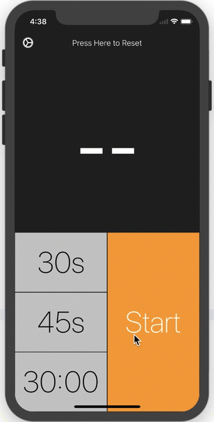
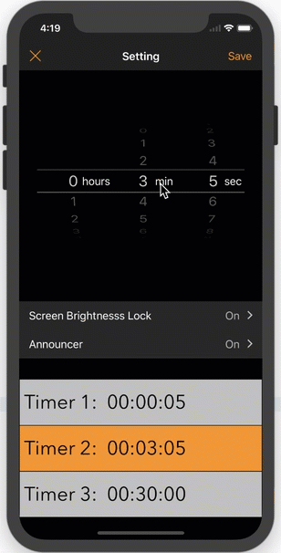
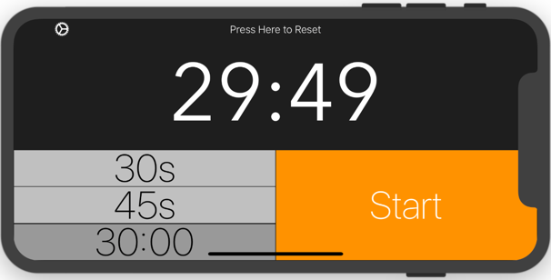
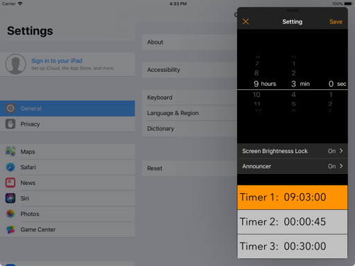

    
    <a href="https://developer.apple.com/swift">.svg"/></a>
    
    
    

## Get Started

This project is written by **Swift 4.0** and requires **Xcode 9+**.

* Open the TimerS workspace in Xcode 9+
* Build and run

## Feature

#### Run Background

TimerS does not have background process. If you terminate the process or even shutdown the device, Timers still counts time correctly. TimerS records users' operations in **UserDefaults**, it compares the current time and start time to calculate displayed time when you are using.

#### Customed UIPickView

Customed UIPickerView displays hours, minutes and seconds. When set timer to 0:

#### Autolayout & Universal

Build interface by AutoLayout and Storyboard. Support universal devices and split view on iPad:

## License
TimerS is released under the **MIT** license. See [LICENSE](https://opensource.org/licenses/MIT) for details

## [中文介绍](README.zh-cn.md) ##